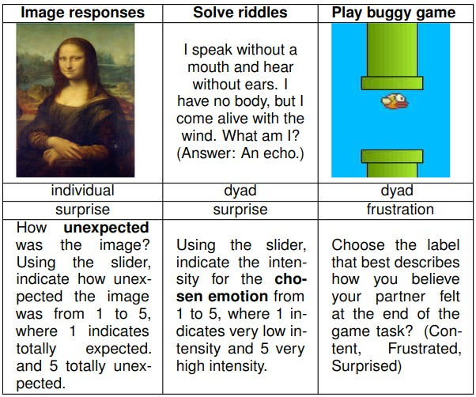

#  FUSE - FrUstration and Surprise Expressions: A Subtle Emotional Multimodal Language Corpus
FUSE is a a novel multimodal corpus for expressive task-based spoken language and dialogue, focused on language use under frustration and surprise, elicited from three tasks. The dataset was collected from 39 subjects from 20 sessions (2 subject in each session but one was removed). The participants performed three tasks: one individually and two in pairs. The dataset consists of facial features, manually verified transcipts in wordwise and utterance format and annotations. The annotation consists of self-annotation and annotation for partner.

## Description of the dataset
### File Structure
The file `fuse.7z` is a compressed dataset. You will need to extract the files. The decompressed dataset follows following directory structure.
```

    ├── fuse
        ├── Game
        |    ├── annotation
        |    |    ├── response.csv: overall annotation for all sessions including self and partner annotation.
        |    |    └── response.md: description of overall annotation and individual subject's response within session_xx.
        |    ├── session_01
        |    |    ├── subject_01
        |    |    |   ├── annotation
        |    |    |   |   └── response.csv 
        |    |    |   ├── transcriptions
        |    |    |   |   ├── utterancewise_transcript.csv
        |    |    |   |   └── wordwise_transcript.csv
        |    |    |   └── video
        |    |    |       └── Facial_features
        |    |    |           └── fer.csv
        |    |    └── subject_02
        |    |        ├── annotation
        |    |        |   └── response.csv 
        |    |        ├── transcriptions
        |    |        |   ├── utterancewise_transcript.csv
        |    |        |   └── wordwise_transcript.csv
        |    |        └── video
        |    |            └── Facial_features
        |    |                └── fer.csv
        |    ├── session_02
        |         ├── subject_03/
        |    |    └── subject_04/
        :    :
        |    └── session_20/
        ├── Riddle
        |    ├── annotation/
        |    ├── session_01/
        :    :
        |    └── session_20/
        └── Image
             ├── annotation
             |   └── response.md
             ├── session_01/
             ├── session_03/
             :
             └── session_19/
```
### Tasks


The dataset consists of three folders named Game, Image, and Riddle representing three tasks performed by the participants. 
#### 1. Image
This is an individual task. Each participant was shown nine image triads. First, a question prompted verbal responses. Then, an unexpected fact was revealed to elicit subtle surprise. Only half sessions performed the Image task.
#### 2. Game
Two participants play a buggy version of Flappy Bird game taking turns and collaborating verbally seeking a high score in 3-minute session.
#### 3. Riddle
Two participants solve four unexpected riddles discussing with each other.
#TODO 
### Details
This dataset consists of two primary modalities: facial features and spoken transcriptions collected from the subjects during the tasks. The dataset also consists of rich annotation. Only self annotation for individual Image based task and annotation for self and partner during paired tasks.
#### 1. **`Facial features`**
Each subject data consists of a directory `video/Facial_features` with file `fer.csv` which consists of following fields

1. : Number representing each sample
2. **Timestamp**: Timestamp of the sample collection
3. **SlideEvent**: Marks each stimuli. StartSlide and StartMedia refers to start of the stimuli and actual display. StartMedia is to considered for start of stimuli. EndSlide and EndMedia refers to end of the stimuli. EndMedia to be considered for end of the stimuli/task. For other timestamps, SlideEvent is 0.
4. **SourceStimuliName**: Name of the stimuli shown. Consider only Img_*_2 for image based tasks, WebSiteRecording-1 for game and Survey-1 for riddle as SourceStimuliName.
5. **Facial feature based Affectiva affective states**: Affectiva's facial expression based affective state suggestion. The included states are Anger, Contempt, Disgust,Fear, Joy, Sadness, and Surprise.
6. **Affectiva emotion metrics**: Additional Affectiva metrics: Engagement and Valence.
7. **Facial features**: Facial Action Coding units ranging from 0 to 100. The features included are: Attention, Brow Furrow, Brow Raise, Cheek Raise, Chin Raise, Dimpler, Eye Closure, Eye Widen, Inner Brow Raise, Jaw Drop, Lip Corner Depressor, Lip Press, Lip Pucker, Lip Stretch, Lip Suck, Lid Tighten, Mouth Open, Nose Wrinkle, Smile, Smirk, Upper Lip Raise.
8. **Pitch,Yaw & Roll**: Estimations of head positions.

#### 2. **`Transcriptions`**
Each transcriptions directory consists of two files `utterancewise_transcript.csv` and `wordwise_transcript.csv`. The utterancewise transcript consists of following fields

1. : Number representing utterance sequence
2. **speaker**: speaker order. 1 for first participant in session and 2 for second.
3. **utterance**: the utterance by speaker
4. **s_ts**: start timestamp of the utterance
5. **e_ts**: end timestamp of the utterance

Wordwise transcript provides fine-grained wordwise timestamp and the file has following fields

1. : Number representing utterance sequence
2. **speaker**: speaker order. 1 for first participant in session and 2 for second.
3. **word**: word spoken by speaker
4. **s_ts**: start timestamp of the word
5. **e_ts**: end timestamp of the word

#### 3. **`Annotation`**
We provide one annotation per subject for all tasks within subject_*/ directory. Additionally, for paired tasks we also provide a detailed comprehensive annotation within fuse/Game/annotation and fuse/Riddle/annotation consisting of all the annotations: Self and partner reporting.


## Disclaimer and License
This dataset is licensed under the <a href="https://creativecommons.org/licenses/by-nc/4.0/" target="_blank">Creative Commons Attribution-NonCommercial 4.0 International License (CC-BY-NC-4.0)</a> and subject to [DISCLAIMER](DISCLAIMER). 
 


## Citation and Contact

For any questions about this dataset, please contact Rajesh Titung at [rt7331@rit.edu](mailto:rt7331@rit.edu).
